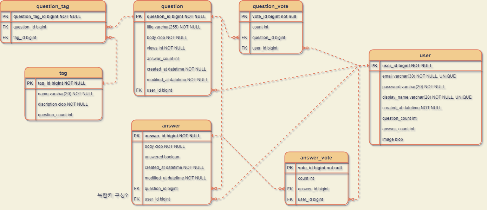
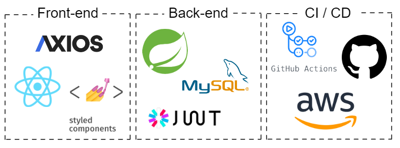

#  👼 파닥몬 진화
Stack Overflow Clone

배포 링크 : <http://padakmon-client-bucket.s3-website.ap-northeast-2.amazonaws.com/>

데모 영상 : <https://www.youtube.com/watch?v=T6uEMcfgvec/>

프로젝트 기간 : 2022.10.20 ~ 2022.11.07

  

## Team Members
|Front-end|Front-end|Front-end|Back-end|Back-end|
|:--:|:--:|:--:|:--:|:--:|
|최주은(팀장)|김효중|박민경|김기홍|남기범|
||||||
|[@callmejeje](https://github.com/callmejeje)|[@rlgywnd](https://github.com/rlgywnd)|[@ALSRUD29](https://github.com/ALSRUD29)|[@broaden-horizon](https://github.com/broaden-horizon)|[@GIVEN53](https://github.com/GIVEN53)|

  

## ER-Diagram

  

## Built With

  

## API Documentation
__[API 명세서 Spreadsheets](https://docs.google.com/spreadsheets/d/1-iXshYqORqqHqV7H4DwgY6rGc-bIFUwD56sRcG_qjQo/edit?usp=sharing)__

  

## Git Convention

- feat : 새로운 기능 추가
- fix : 버그 수정
- docs : 문서 수정
- test : 테스트 코드 추가
- refactor : 코드 리팩토링
- style : 코드 의미에 영향을 주지 않는 변경사항
- chore : 빌드 부분 혹은 패키지 매니저 수정사항
